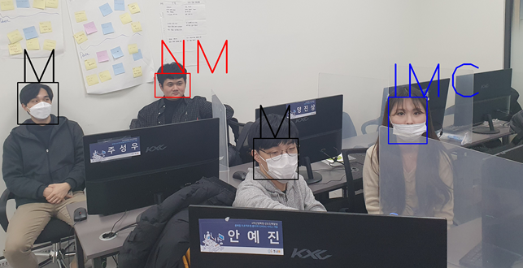

# 2020-11-22

* 얼굴 인식 모델 확인

  * 추후 세부 코드 학습예정

* 마스크 인식 모델 확인

  * 착용여부는 구별하지만 잘못된 방식 ( 코에 마스크를 건 형태) 에서는 낮은 정확도

# 2020-11-23
* 모델 만들어보기 MobileNetV2

  *  착용여부는 구별하지만 잘못된 방식 ( 코에 마스크를 건 형태) 에서는 낮은 정확도
  *  학습 데이터 정리 후 학습이 필요
  

# 2020-11-24

* 데이터 노이즈 제거

# 2020-11-25

* AWS 서버 설정
* MobileNetV2로 모델 생성
  * face detect를 한 데이터 보다 원본이미지에서 정확도 상승
  * 모델 학습할 경우 face detect한 데이터를 이용해 학습이 필요하다고 판단
  * 마스크를 제대로 쓰지 않은 데이터 (코, 턱)가 더 다양하게 필요하다고 판단

# 2020-11-26

* 모델 Hidden Layer 개수를 줄여 모델의 크기 감소
  * 정확도가 떨어지는 문제 발생, Hidden Layer개수를 점차적으로 늘리며 정확도 개선 필요

# 2020-11-27

* gray scale 이미지로 학습
  * Data에 없는 색의 마스크의 구별에 문제가 발생한다고 보여짐
  * channel이 1개로 변함에 따라 pretrained 모델로 학습이 불편해짐.
  * 이미지를 gray scale channel 3개로 변환 후 저장 

# 2020-11-28

*  gray scale channel 3개로 변환된 이미지를 통해 전이학습 진행
  * channel이 1개일 때의 학습모델에 비해 다른색의 마스크의 착용여부는 구별이 가능.
  * Data set에 없는 사진의 경우 아직 낮은 정확도를 보임

# 2020-11-30

* 기존의 전이모델(`MobileNetv2`)에서 다른 모델 (`DenseNet201` , `InceptionV3`,`EfficientNetB7`) 사용
  * `DenseNet201` : 기존의 합성 마스크는 구별 가능하나 Data에 없는 마스크의 잘못된 착용은 구별 못함
  * `InceptionV3` :  `DenseNet201`과 마찬가지 Data에 없는 사진을 구별하는 능력이 DenseNet보다 떨어짐
  * `EfficientNetB7` : 학습과정에서 너무 낮은 acc로 고려 안하기로 결정

* Data 정리 후 다시 학습필요

# 2020-12-01

* Xception, InceptionResNetV2 를 이용한 전이모델 시험
  * 이전에 했던 전이학습에 구분하지 못했던 이미지를 제대로 구분하는 결과를 보여줌
* Yolo-v3 작업 준비 중

# 2020-12-02

* 가상환경 문제로 인해 가상환경 복구작업

# 2020-12-03

* 기존의 마스크 착용, 미착용 2가지 클래스 방식 모델 150장 test 결과 정확도 70% 정도 확인
* 마스크 착용, 미착용, 잘못된 착용 3가지 클래스 모델 제잘 후 150장 test 결과 검증
  * 마스크 착용자  : 0,    마스크 미착용자 : 1,  마스크 불량 착용자 : 2로 분류     
  * 정확도 82%를 기록,  미착용과 불량 착용의 결과를 같은 범주로 포함한 결과 정확도 94.7%를 보임 
* `haar cascades`를 통해 모델로 한번 판별 후 2차 판별 구상 중 

# 2020-12-04

* `haar cascades`를 적용시켜 2차 판별을 통해 model이 predict한 값을 변경해주는 작업 추가
* predict가 1 혹은 2로 분류되었을 경우 `haar cascades`의 코 위치 탐색으로 predict 값 변경
  * 일부 사진들에서 정확하게 예측했으나 `haar cascades` 오류로 오답으로 변경되는 현상 발생

|    Score     | 3 class | 불량, 미착용자 같은 class | harr 적용 |
| :----------: | :-----: | :-----------------------: | :-------: |
|   Xception   |   80%   |            93%            |    91%    |
| DenseNet201  |   82%   |           94.7%           |    92%    |
| MobileNetV2  |   72%   |           92.7%           |   92.7%   |
| NASNetMobile |   78%   |            90%            |    88%    |
| ResNet152V2  |  77.3%  |           92.7%           |   92.7%   |

* 마스크 착용자, 미착용자 data에 대해서는 높은 정확도를 보이지만 불량 착용자는 낮은 정확도.
* 정면이 아닌 data에 대해서 낮은 정확도.

# 2020-12-05

* 데이터셋 변경 ( 측면 사진 추가)에서 전이학습 재실행
* 사진 크기에 따른 `haar cascades`의 코 감지 유무 확인, 조정 예정

# 2020-12-07

* IOT에서 촬영한 이미지 파일 model predict
  * 일부 흐릿하고 어두운 이미지에서 얼굴 detecting 불가로 인한 오류발생
* Cloud에서 만든 Web에 model을 올려 predict 실행
  * 불규칙한 predict 시간소요 

# 2020-12-08

* IOT, Cloud와 지속적으로 협업 필요
* 프로젝트 확장안 실내 감시 CCTV 기능을 위한 YOLO_v3  학습 진행

# 2020-12-09

* YOLO_v3 수행을 위한 Labeling 진행

# 2020-12-10

* YOLO_v3 Labeling 완료 및 setting 완료
* 2020/12/11 YOLO_v3 학습 예정

# 2020-12-11

* YOLO v3 학습 결과

# 2020-12-12 ~ 2020-12-15

* YOLO v3의 EPOCHS을 증가시켜 학습
  * Overfitting 현상이 발생, 기존의 weights로 정확히 predict한 물체에 대해 잘못된 predict를 하는 것을 확인

* IOT, Cloud, Big Data와 함께 하드웨어 제작

# 2020-12-16

* YOLO v4 학습 후 v3와 결과 비교
  * 비교결과 이미지가 너무 작은 물체의 경우 두 버젼 모두 인식 불가
  * v4의 경우 인식할 수 있는 이미지가 더 많고, 같은 사진에 대해서 더 정확한 예측을 보임
  * v4의 경우 v3에 비해 predict하는 시간이 오래걸리기는 하지만 실시간이 아니기 때문에 큰 문제가 없다고 생각되어 v4로 변경할 예정